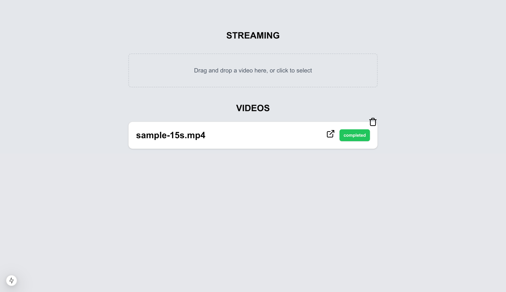

# Streaming Platform

A modern video streaming platform built with Next.js, BullMQ, and DrizzleORM.

## Screenshot


## Features

- Video upload and processing
- Adaptive streaming with video.js
- Queue-based video processing
- Modern UI with Tailwind CSS and Mantine
- SQLite database with DrizzleORM

## Prerequisites

- Node.js (Latest LTS version)
- PNPM package manager
- Redis server (for BullMQ)
- FFmpeg (for video processing)

## Setup Instructions

1. **Clone the repository**
   ```bash
   git clone https://github.com/Kamleshpaul/streaming.git
   cd streaming
   ```

2. **Install dependencies**
   ```bash
   pnpm install
   ```

3. **Environment Setup**
   Create a `.env` file in the root directory with the following variables:
   ```env
   DATABASE_URL=file:streaming.db
   REDIS_HOST=localhost
   REDIS_PORT=6379
   ```

4. **Database Setup**
   ```bash
   # Generate database migrations
   pnpm db:generate

   # Apply migrations
   pnpm db:migrate
   ```

5. **Start Development Server**
   ```bash
   # This will start both Next.js and the queue processor
   pnpm dev
   ```

   The application will be available at `http://localhost:3000`

## Available Scripts

- `pnpm dev` - Start development server with queue processor
- `pnpm build` - Build the application
- `pnpm start` - Start production server
- `pnpm lint` - Run ESLint
- `pnpm queue:run` - Run queue processor separately
- `pnpm db:generate` - Generate database migrations
- `pnpm db:migrate` - Apply database migrations
- `pnpm db:studio` - Open Drizzle Studio for database management

## Project Structure

- `/app` - Next.js application routes and pages
- `/components` - Reusable React components
- `/drizzle` - Database schema and migrations
- `/lib` - Utility functions and shared code
- `/public` - Static assets
- `/server` - Server-side code and queue processors

## Tech Stack

- **Frontend**: Next.js, React, Tailwind CSS, Mantine UI
- **Backend**: Node.js, BullMQ
- **Database**: SQLite with DrizzleORM
- **Video Processing**: FFmpeg
- **Queue System**: BullMQ with Redis

## Development

The project uses TypeScript for type safety and follows modern React patterns. The video processing is handled through a queue system to ensure reliable processing of uploaded videos.

## License

MIT